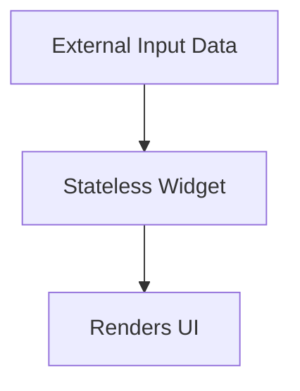
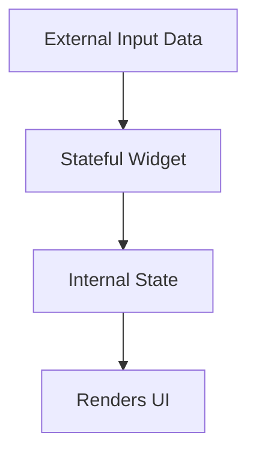

# Flutter Demo App 🚀

This is a simple demo app built with Flutter as part of my first steps in learning cross-platform mobile development.  
It explores the basics of Flutter widgets, especially the difference between **Stateless** and **Stateful** widgets.

---

## 📚 Flutter Widgets: Stateless vs Stateful

### 🟧 Stateless Widget

A **Stateless Widget** is a widget that does not depend on anything other than the information it receives at the time of its build (usually from its parent).  
It cannot rebuild in response to user interactions or internal changes.

🔁 **Rebuilds only when external input data changes.**

---

### 🟩 Stateful Widget

A **Stateful Widget** has an internal state, represented by "internal data" that can change during the widget's lifecycle.  
When the state changes, the widget rebuilds automatically to reflect the new data.

🔁 **Rebuilds when:**
- External input data changes
- Internal state changes

---

## 📝 What I Learned

- The difference between `StatelessWidget` and `StatefulWidget`
- How Flutter rebuilds widgets based on data and state changes
- Basic UI rendering concepts in Flutter

---

## 🔧 Tech Stack

- Flutter
- Dart

---

Feel free to fork this project if you're also learning Flutter!
